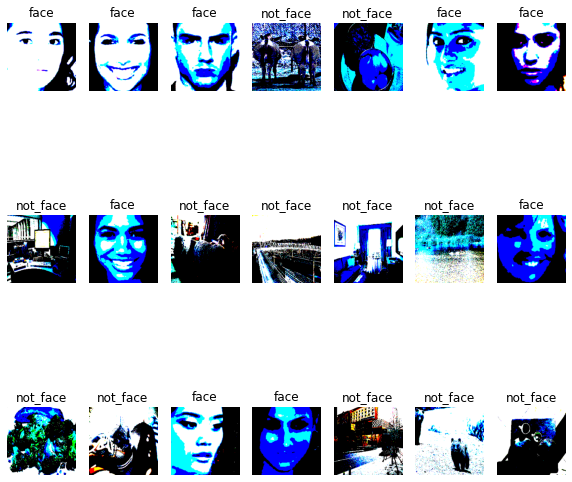

# Sistema de Reconocimento Facial para Control de Personas

Un sistema de reconocimiento facial tiene el objetivo de reconocer personas con ayuda de imágenes de rostros en función de otros rostros previamente almacenados. Algunas de sus aplicaciones son el control de acceso, búsqueda de personas, educación y salud.

Este proyecto tiene como objetivo implementar un sistema de reconocimiento facial para reconocer personas en ambientes cerrados. De esta manera se puede, por ejemplo, tener un buen control de personal en una empresa o asegurar el acceso a edificios de departamentos solo a sus poseedores.

El objetivo del presente proyecto responde a la meta 11.c del objetivo 11 de las ODS (Objetivo de Desarrollo Sostenible) [1]. Que pretende la construcción de edificios sostenibles y resilientes utilizando materiales locales.

## Hardware

El sistema está implementado en un sistema embebido compuesto por una tarjeta de desarrollo ESP32-S3-DevKitC y una cámara OV2640. En la siguiente figura se puede observar un diagrama de bloques del sistema.


La tarjeta de desarrollo ESP32-S3-DevKitC está compuesta principalmente por un módulo ESP32-S3-WROOM-1-N8R8 que posee las siguientes características:
- Procesador: Xtensa® dual-core 32-bit LX7 hasta 240 MHz
- ROM: 384 KB
- RAM: 512 KB
- PSRAM: 8 MB
- Wi-Fi: 802.11 b/g/n
- Bluetooth: Bluetooth LE: Bluetooth 5, Bluetooth mesh
- Periféricos: GPIO, SPI, LCD interface, Camera interface, UART, I2C, I2S, remote control, pulse counter, LED PWM, USB 1.1 OTG, USB Serial/JTAG controller, MCPWM, SDIO host, GDMA, TWAI® controller, ADC, touch sensor, temperature sensor, timers y watchdogs

Además de un amplio conjunto de periféricos y conectividad inalámbrica, posee aceleración para las cargas de trabajo de computación de redes neuronales y procesamiento de señales y hacen a este módulo una opción ideal para una amplia variedad de escenarios de aplicaciones relacionados con AI (Artificial Intelligence) y la AIoT (Artificial Intelligence of Things).

La cámara utilizada posee un sensor OV2640 de OmniVision y posee las siguientes características:
- Resolución máxima: 1600 x 1200 (UXGA)
- Formatro del sensor de imagen: Tipo 1/4″
- Sensibilidad: 0.6V/Lux-sec
- SNR: 40dB
- Rango dinámico: 50dB

## Modelo de visión artificial

Uno de los objetivos en la implementación del modelo de visión artificial fue la utlización de TensorFlow como framework principal, ya que este fue estudiado durante el bootcamp y posee herramientas que ayudan a la reducción de tamaño de modelos de redes neuronales, y con la ayuda de TensorFlow Lite se pueden implementar en sistemas embebidos.

Se estudiaron varios modelos de visión artificial para reconocimiento de rostros, la mayoría de ellos están basados en la siguiente arquitectura.


El primer paso es procesar la imagen obtenida por una cámara u otra fuente para que sus propiedades (resolución, canales, tipo de datos, etc) sean las requeridas por el modelo de detección de rostros. A la salida de este primer modelo se tienen los bounding boxes de todos los rostros contenidos en la imagen de entrada, con estos datos se deben obtener nuevas imágenes escaladas de cada de los rostros para que estos ingresen al modelo de extracción de embeddings. La extracción de embeddings es el proceso de obtener features de alta calidad de un rostro en un tamaño de memoria pequeño, cada embedding debe ser representativo del rostro de entrada. Finalmente, el nuevo embedding obtenido de un rostro se compara con otros almacenados previamente para determinar la similitud, y si la hay obtener una respuesta positiva o negativa en caso contrario.

El primer modelo planteado anteriormente tiene varias implementaciones, pero la más popular es la de MTCNN (Multi-task Cascaded Convolutional Networks), descrita en el paper [2]. Esta consiste en 3 modelos distintos denominados P-Net, R-Net y O-Net, que primero determinan secciones de la imagen candidatas a ser rostros y luego se filtran para obtener los candidatos positivos. Al ser un modelo compuesto por 3 modelos distintos este acercamiento se hizo inviable desde el punto de vista de memoria del sistema.

Otro modelo estudiado fue el de [3], que propone un modelo muy atractivo en tiempo de inferencia, precisión y tamaño en memoria. Pero su implementación requiere post procesamiento extensivo que exige operadores como NonMaxSuppression o Where, que no se encuentran disponibles para ser utilizados en TensorFlow Lite.

Un modelo también atractivo es el descrito en [4], que enfoca su implementación para sistemas de poca memoria RAM, donde utiliza un modelo P-Net para filtrar secciones de imágenes candidatas a contener rostros y otro modelo optmizado planteado en [5]. Este modelo se muestra en la siguiente imagen.


El modelo anterior, si bien parece adecuado a la aplicación, necesita un preprocesamiento que consiste en image pyramid y sliding window. Ambos procesos generan un costo computacional y de memoria importante, ya que por cada candidato de salida de P-Net se debe hacer una inferencia en RFD-CNN, lo que provocaría un tiempo importante para determinar los rostros en la imagen. Además que el tiempo de desarrollo del pre procesamiento es prolongado, ya que todas las operaciones deben ser escritas en lenguaje C o C++ para ser compatibles con el sistema.

Debido a la cantidad de tiempo disponible para el desarrollo se optó por otro enfoque para la detección de rostros. El método consiste en entrenar un modelo binario para clasificar la presencia de un solo rostro y de esta manera simplificar el preprocesamiento previo de otros métodos. Para la obtención de un solo rostro por la cámara la persona objetivo debe posicionar de tal forma que el marco de la imagen capte únicamente su rostro como se muestra en la siguiente imagen.


La manera más óptima de realizar este modelo fue utlizar transfer learning en TensorFlow con el modelo MobileNetV1 [6], donde se descartaron las capas superiores para implementar un clasificador binario.

Se creó un dataset propio con dos categorías: face y not_face. Este consiste en imágenes de rostros para la categoría face y de cualquier otra imagen excepto rostros para la categoría not_face. El dataset se encuentra en [dataset/](dataset/).

En el siguiente enlace se puede abrir el notebook utlizado para el modelo antes descrito.

<table class="tfo-notebook-buttons" align="center">
  <td>
    <a target="_blank" href="https://colab.research.google.com/github.com/mauriciobarroso/esp32s3_face-recognition/notebooks/one_face_classifier.ipynb">Google Colaboratory</a>
  </td>
</table>

En la siguiente imagen se puede observar el modelo propuesto.


Posterior al entrenamiento se observa una gráfica para visualizar el accuracy el loss del modelo.


Con ayuda de la función converter se obtienen varios modelos, estos se describen en la siguiente tabla:

| Name | Format | Target Framework | Target Device |
| :------------- |:-------------|:-------------|-----|
| `model.tflite` *(3.5 MB)*  | int8 Quantized TFLite Model | TensorFlow Lite | Mobile Devices|
| `model.cc`  | C Source File | TensorFlow Lite for Microcontrollers | Microcontrollers |

En la siguiente imagen se puede observar los resultados de la inferencia hecha con el modelo cuantizado a int8. Los colores incorrectos son debido a la cuantización de las imágenes a int8.




El proyecto actualmente se encuentra en la primera de las tres fases del reconocimiento de rostros, es decir, se tiene implementado un modelo para detectar un solo rostro bien posicionado con un modelo de TensoFlow Lite cuantizado a 8 bits.

El siguiente paso es buscar la mejor estrategia para implementar el extractor de embeddings de los rostros. Para eso, actualmente se están estudiando dos posibilidades. La primera es tratar de implementar MobileFaceNet [7] y crear un modelo de TensorFlow Lite cuantizado a 8 bits, mientras que la segunda opción es enviar la imagen del rostro obtenido por el modelo implementado para detección de rostros y utilizarlo como entrada para un modelo de reconocimiento facial en Rekognition [8] en AWS (Amazon Web Services).

## Firmware

Para el desarrollo del firmware se tenian varias posibilidades, como Arduino, ESP-IDF y Platformio, entre otras.

Se eligió ESP-IDF por ser el framework oficial para el ESP32-S3 y por que integra FreeRTOS como sistema operativo en tiempo real. También permite el acceso a funciones de bajo nivel que optimizan en gran manera los tiempos de ejecución del código desarrollado y posee herramientas para depuración.

El objetivo principal del firmware es inicializar la cámara para obtener imágenes RGB en formato 224x224 y utlizarlas como entrada al modelo de visión artificial antes descrito. Con los datos de salida del modelo se determina la presencia de un rostro y esta información es enviada mediante MQTT (MQ Telemetry Transport) hacia AWS para después poder ser visualizada.

En la siguiente figura se puede observar un diagram de componentes del firmware donde se pueden apreciar sus dependencias.


A continuación se describe brevemente la utilidad de cada uno de los componentes del digrama anterior:
- Application: es la aplicación principal y utliza todos los componentes de capas inferiores para realizar las tareas del sistema que se describieron anteriormente. Es de creación propia
- WS2812: contiene funciones para inicializar y utlizar un led RGB direccionable modelo WS2812. Es proporcionando por Espressif
- MQTT: contiene funciones y deficiones para utilizar el protocolo MQTT. Es parte de ESP-IDF
- Wifi: contiene funciones para inicializar, brindar credenciales y utlizar las funciones de Wi-Fi. Es de creación propia
- Camera: contiene funciones wraper para inicializar la cámara utlizada. Es de creación propia
- ESP32-camera: contiene funciones y deficiones para utilizar distintos tipos de cámaras. Es proporcionado por Espressif
- NVS: contiene funciones para manejar el almacenamiento no volátil implementado en la memoria flash. Es parte de ESP-IDF
- ESP-IDF + FreeRTOS: contiene el framework para utlizar los SoCs de Espressif, viene integrado con FreeRTOS como sistema operativo de tiempo real. Es prorporcionado por Espressif
- ESP-NN: contiene el framework para desarrollar aplicaciones con redes neuronales en la familia de SoCs de Espressif, también posee optimizaciones para de operadores para el ESP32-S3. Es proporcionado por Espressif
- TFLITE-lib: contiene el framework TensorFlow Lite para microcontroladores. Es proporcionado por TensorFlow

Para inicializar correctamente TensorFlow Lite para microcontroladores se deben seguir una serie de pasos, los mismos se describen ahora.

1. Se define el tamaño de tensor arena (entradas, salidas y arrays intermedios). El tamaño ideal se obtiene mediante pruebas
```
#define SCRATH_BUFFER_SIZE (39 * 1024)
#define TENSOR_ARENA_SIZE (81 * 1024 + SCRATH_BUFFER_SIZE)

static uint8_t * tensor_arena;
```
2. Se deben declarar los punteros al error reporter, modelo, intérprete y entrada del modelo
```
tflite::ErrorReporter * error_reporter = nullptr;
const tflite::Model * face_detection_model = nullptr;
tflite::MicroInterpreter * face_detection_interpreter = nullptr;
TfLiteTensor * face_detection_input = nullptr;
```
3. Se inicializa el modelo
```
face_detection_model = tflite::GetModel(g_face_detection_model_data);
```
4. Se asigna memoria dinámica al tensor arena
```
tensor_arena = (uint8_t *)heap_caps_malloc(TENSOR_ARENA_SIZE, MALLOC_CAP_INTERNAL | MALLOC_CAP_8BIT);
```
5. Se instancian los operadores para el intérprete. Se pueden utilizar todos pero esto genera un gasto innecesario de memoria, es preferible instanciar solo los necesarios. Una forma de conocer los operadores utilizados es utilizar el script [visualize.py](https://raw.githubusercontent.com/tensorflow/tensorflow/master/tensorflow/lite/tools/visualize.py) para obtener una descripción del modelo en formato .tflite. Del modelo actual los operadores necesarios son 6, según la siguiente image.


```
static tflite::MicroMutableOpResolver<6> resolver;
resolver.AddConv2D();
resolver.AddDepthwiseConv2D();
resolver.AddPad();
resolver.AddMean();
resolver.AddFullyConnected();
resolver.AddLogistic();
```
6. Inicializar el intérprete con los datos anteriores
```
static tflite::MicroInterpreter face_detection_static_interpreter(
        face_detection_model,
        resolver,
        tensor_arena,
        TENSOR_ARENA_SIZE,
        error_reporter);

face_detection_interpreter = &face_detection_static_interpreter;
```
7. Asignar memoria para los tensores
```
TfLiteStatus allocate_status = face_detection_interpreter->AllocateTensors();

```
8. Definir una variables para manipular la entrada del modelo
```
face_detection_input = face_detection_interpreter->input(0);

```

Con todos los pasos anteriores lo ya se tiene el modelo listo para realizar una inferencia con los datos de entrada provistos por la cámara. Para obtener los datos de salida se realizan los siguientes pasos.
1. Se invoca al intérprete para realizar la inferencia con los datos de entrada
```
face_detection_interpreter->Invoke();
```
2. Se leen los datos de salida de la salida del intérprete
```
TfLiteTensor * output = face_detection_interpreter->output(0);
```

La salida debe ser interpretada por el usuario, ya que solo el sabe que significa. Para este caso se detecta la presencia de un rostro en una imagen obtenida por la cámara.

Con ayuda del monitor de ESP-IDF se puede visualizar la salida de consola del ESP32-S3, cuando se detecta un rostro la salida es como sigue, con un mensaje indicando la detección de un rostro.
```
W (40297120) wifi:<ba-del>idx
W (40310440) wifi:<ba-add>idx:0 (ifx:0, b0:be:76:04:3e:15), tid:0, ssn:1196, winSize:64
I (40342240) app: Face detected!
W (40387490) wifi:<ba-del>idx
W (40392570) wifi:<ba-add>idx:0 (ifx:0, b0:be:76:04:3e:15), tid:0, ssn:1220, winSize:64
cam_hal: EV-VSYNC-OVF
```

Cada vez que un rostro es detecta se configura una mensaje para ser enviado a AWS, de esta manera se puede tener un log sobre el trabajo realizado por el sistema embebido.

Al momento de implementar el protocolo MQTT con seguridad TLS se suscitó un conflicto de memoria. Para utilizar este protocolo de seguridad se asigna memoria dinámica en el momento del handshake, pero casi la totalidad de la memoria es asignada al modelo de visión artificial. Al momento de ejecutar el código la salida de consola mostraba el siguiente error.

```
E (6028) esp-tls-mbedtls: mbedtls_ssl_setup returned -0x7F00
E (6028) esp-tls: create_ssl_handle failed
E (6028) esp-tls: Failed to open new connection
E (6038) TRANSPORT_BASE: Failed to open a new connection
E (6038) MQTT_CLIENT: Error transport connect
```

Para corregir esto se tuvo que cambiar el tipo de memoria para asignar al tensor arena. Antes se asignaba del heap (memoria RAM interna), ahora se asigna del la memoria PSRAM conectada por SPI.
```
tensor_arena = (uint8_t *)heap_caps_malloc(TENSOR_ARENA_SIZE, MALLOC_CAP_SPIRAM | MALLOC_CAP_8BIT);
```

Con este cambio el sistema quedó funcionando de la manera esperada y cada vez que se detectaba un rostro se podía observar en el broker de AWS. En la siguiente figura se observa el log de dicho broker.


## Instalación

### 1. Instalar pre requisitos
Para compilar con ESP-IDF son necesarios los siguientes paquetes

```
sudo apt-get install git wget flex bison gperf python3 python3-pip python3-setuptools cmake ninja-build ccache libffi-dev libssl-dev dfu-util
```

### 2. Obtener ESP-IDF
ESP-IDF prorporciona bibliotecas y herramientas para desarrollar código sobre sus SoCs

```
mkdir ~/esp
cd ~/esp
git clone -b release/v4.4 --recursive https://github.com/espressif/esp-idf.git
```

### 3. Instalar las herramientas
Se necesitan instalar las herramientas para compilar, depurar, etc

```
cd ~/esp/esp-idf
./install.sh esp32s2
```

### 4. Definir las variables de entorno
Esto se hace con el siguiente comando

```
cd ~/esp/esp-idf
. $HOME/esp/esp-idf/export.sh
```

### 5. Clonar el proyecto
To buld and flash this application you need clone it in your workspace with the next command:

```
git clone --recursive https://github.com/mauriciobarroso/esp32s3_face-recognition.git
```

### 6. Build, flash y monitor
El proyecto viene listo para ser compilado y grabado en el Soc, las configuraciones por defecto son definidas en los archivos `sdkconfig.defaults` y `sdkconfig.defaults.esp32s3`. En la carpeta [code](code/) ejecutar los siguientes comandos

```
idf.py fullclean
idf.py set-target esp32s3
idf.py build
idf.py flash monitor
```

### 7. Verificar
Si la compilación y grabado se hicieron de manera correcta, se debería poder observar algo como esto

```
ESP-ROM:esp32s3-20210327
Build:Mar 27 2021
rst:0x1 (POWERON),boot:0x8 (SPI_FAST_FLASH_BOOT)
SPIWP:0xee
mode:DIO, clock div:1
load:0x3fcd0108,len:0x17ac
load:0x403b6000,len:0xe28
load:0x403ba000,len:0x30d4
entry 0x403b6274
I (25) boot: ESP-IDF v4.4.1-dirty 2nd stage bootloader
I (25) boot: compile time 03:31:59
I (25) boot: chip revision: 0
I (27) qio_mode: Enabling default flash chip QIO
I (32) boot.esp32s3: Boot SPI Speed : 80MHz
I (37) boot.esp32s3: SPI Mode       : QIO
I (42) boot.esp32s3: SPI Flash Size : 8MB
I (46) boot: Enabling RNG early entropy source...
I (52) boot: Partition Table:
I (55) boot: ## Label            Usage          Type ST Offset   Length
I (63) boot:  0 nvs              WiFi data        01 02 00009000 00006000
I (70) boot:  1 phy_init         RF data          01 01 0000f000 00001000
I (78) boot:  2 factory          factory app      00 00 00010000 00180000
I (85) boot: End of partition table
I (89) esp_image: segment 0: paddr=00010020 vaddr=3c0c0020 size=73a24h (473636) map
I (169) esp_image: segment 1: paddr=00083a4c vaddr=3fc96a10 size=055e8h ( 21992) load
I (174) esp_image: segment 2: paddr=0008903c vaddr=40374000 size=06fdch ( 28636) load
I (181) esp_image: segment 3: paddr=00090020 vaddr=42000020 size=b44cch (738508) map
I (296) esp_image: segment 4: paddr=001444f4 vaddr=4037afdc size=0ba34h ( 47668) load
I (305) esp_image: segment 5: paddr=0014ff30 vaddr=50000000 size=00010h (    16) load
I (313) boot: Loaded app from partition at offset 0x10000
I (313) boot: Disabling RNG early entropy source...
I (325) opi psram: vendor id : 0x0d (AP)
I (325) opi psram: dev id    : 0x02 (generation 3)
I (326) opi psram: density   : 0x03 (64 Mbit)
I (329) opi psram: good-die  : 0x01 (Pass)
I (334) opi psram: Latency   : 0x01 (Fixed)
I (339) opi psram: VCC       : 0x01 (3V)
I (343) opi psram: SRF       : 0x01 (Fast Refresh)
I (349) opi psram: BurstType : 0x01 (Hybrid Wrap)
I (354) opi psram: BurstLen  : 0x01 (32 Byte)
I (359) opi psram: Readlatency  : 0x02 (10 cycles@Fixed)
I (365) opi psram: DriveStrength: 0x00 (1/1)
W (370) PSRAM: DO NOT USE FOR MASS PRODUCTION! Timing parameters will be updated in future IDF version.
I (381) spiram: Found 64MBit SPI RAM device
I (385) spiram: SPI RAM mode: sram 80m
I (390) spiram: PSRAM initialized, cache is in normal (1-core) mode.
I (397) cpu_start: Pro cpu up.
I (400) cpu_start: Starting app cpu, entry point is 0x403754a8
0x403754a8: call_start_cpu1 at /home/mauricio/esp/esp-idf-v4.4.1/components/esp_system/port/cpu_start.c:160

I (0) cpu_start: App cpu up.
I (692) spiram: SPI SRAM memory test OK
I (700) cpu_start: Pro cpu start user code
I (700) cpu_start: cpu freq: 240000000
I (700) cpu_start: Application information:
I (703) cpu_start: Project name:     facereg
I (708) cpu_start: App version:      1.0.0
I (713) cpu_start: Compile time:     Jul 14 2022 03:34:33
I (719) cpu_start: ELF file SHA256:  80dc68e0f11032fd...
I (725) cpu_start: ESP-IDF:          v4.4.1-dirty
I (730) heap_init: Initializing. RAM available for dynamic allocation:
I (738) heap_init: At 3FC9FF98 len 00040068 (256 KiB): D/IRAM
I (744) heap_init: At 3FCE0000 len 0000EE34 (59 KiB): STACK/DRAM
I (751) heap_init: At 600FE000 len 00002000 (8 KiB): RTCRAM
I (757) spiram: Adding pool of 8192K of external SPI memory to heap allocator
I (765) spi_flash: detected chip: generic
I (770) spi_flash: flash io: qio
I (774) sleep: Configure to isolate all GPIO pins in sleep state
I (780) sleep: Enable automatic switching of GPIO sleep configuration
I (788) cpu_start: Starting scheduler on PRO CPU.
I (0) cpu_start: Starting scheduler on APP CPU.
I (808) app: Initializing components..
I (808) app: Example configured to blink addressable LED!
I (818) s3 ll_cam: DMA Channel=4
I (818) cam_hal: cam init ok
I (818) sccb: pin_sda 4 pin_scl 5
I (848) camera: Detected camera at address=0x30
I (848) camera: Detected OV2640 camera
I (848) camera: Camera PID=0x26 VER=0x42 MIDL=0x7f MIDH=0xa2
I (918) s3 ll_cam: node_size: 3072, nodes_per_line: 1, lines_per_node: 16
I (918) s3 ll_cam: dma_half_buffer_min:  3072, dma_half_buffer:  9216, lines_per_half_buffer: 48, dma_buffer_size: 27648
I (928) cam_hal: buffer_size: 27648, half_buffer_size: 9216, node_buffer_size: 3072, node_cnt: 9, total_cnt: 2
I (938) cam_hal: Allocating 9216 Byte frame buffer in PSRAM
I (938) cam_hal: Allocating 9216 Byte frame buffer in PSRAM
I (948) cam_hal: cam config ok
I (948) ov2640: Set PLL: clk_2x: 1, clk_div: 3, pclk_auto: 1, pclk_div: 8
I (1038) wifi: Initializing wifi component...
I (1038) pp: pp rom version: e7ae62f
I (1038) net80211: net80211 rom version: e7ae62f
I (1048) wifi:wifi driver task: 3fce6df8, prio:23, stack:6656, core=0
I (1048) system_api: Base MAC address is not set
I (1048) system_api: read default base MAC address from EFUSE
```

## Trabajo a futuro

- Entrenar un modelo similar al utlizado para imágenes en escala de grises.
- Investigar modelos de para extracción de embeddings de rostros óptimos para sistemas embebidos y su aplicabilidad al proyecto.
- Investigar e implementar AWS Rekognition.
- Desarrollar un dashboard para visualizar resultados de manera más pulcra.
- Limpiar y testear el código del proyecto.
- Determinar el consumo de memoria para optimizarlo.

## Creditos
El código fue inspirado por el ejemplo [person_detection](https://github.com/tensorflow/tflite-micro/tree/main/tensorflow/lite/micro/examples/person_detection) de TensoFlow Lite, por el [tutorial](https://www.tensorflow.org/lite/microcontrollers/get_started_low_level) proporcionado en la página oficial de TensorFlow y los ejemplos en el [repositorio](https://github.com/espressif/esp-idf/tree/master/examples) de ESP-IDF.

## Referencias
[1] Objetivo 11: Lograr que las ciudades sean más inclusivas, seguras, resilientes y sostenibles, https://www.un.org/sustainabledevelopment/es/cities/

[2] Joint Face Detection and Alignment using
Multi-task Cascaded Convolutional Networks, https://arxiv.org/pdf/1604.02878.pdf

[3] Ultra-Light-Fast-Generic-Face-Detector-1MB, https://github.com/Linzaer/Ultra-Light-Fast-Generic-Face-Detector-1MB

[4] A lightweight face detection method working with
Himax Ultra-Low Power WE-I Plus AI Processor, https://cms.tinyml.org/wp-content/uploads/talks2022/A-lightweight-face-detection_Justin-Kao.pdf

[5] Fast deep convolutional face detection in the wild
exploiting hard sample mining, https://cidl.csd.auth.gr/resources/journal_pdfs/triantafyllidou_nousi_tefas_big_data_and_neural_networks.pdf

[6] MobileNets: Efficient Convolutional Neural Networks for Mobile Vision
Applications, https://arxiv.org/pdf/1704.04861.pdf

[7] MobileFaceNets: Efficient CNNs for Accurate RealTime Face Verification on Mobile Devices, https://arxiv.org/pdf/1804.07573.pdf

[8] Análisis de imágenes y videos con machine learning - Amazon Rekognition - Amazon Web Services, https://aws.amazon.com/es/rekognition/

## Licencia

MIT License

Copyright (c) 2022 Mauricio Barroso Benavides

Permission is hereby granted, free of charge, to any person obtaining a copy of this software and associated documentation files (the "Software"), to deal in the Software without restriction, including without limitation the rights to use, copy, modify, merge, publish, distribute, sublicense, and/or sell copies of the Software, and to permit persons to whom the Software is furnished to do so, subject to the following conditions:

The above copyright notice and this permission notice shall be included in all copies or substantial portions of the Software.

THE SOFTWARE IS PROVIDED "AS IS", WITHOUT WARRANTY OF ANY KIND, EXPRESS OR IMPLIED, INCLUDING BUT NOT LIMITED TO THE WARRANTIES OF MERCHANTABILITY, FITNESS FOR A PARTICULAR PURPOSE AND NONINFRINGEMENT. IN NO EVENT SHALL THE AUTHORS OR COPYRIGHT HOLDERS BE LIABLE FOR ANY CLAIM, DAMAGES OR OTHER LIABILITY, WHETHER IN AN ACTION OF CONTRACT, TORT OR OTHERWISE, ARISING FROM, OUT OF OR IN CONNECTION WITH THE SOFTWARE OR THE USE OR OTHER DEALINGS IN THE SOFTWARE.

